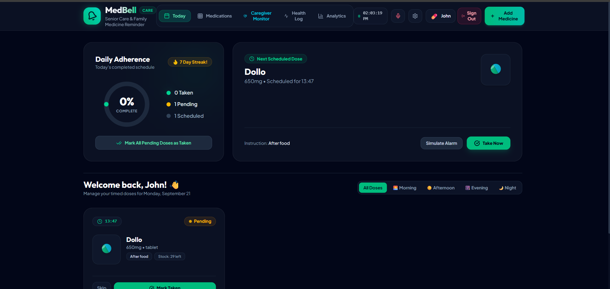
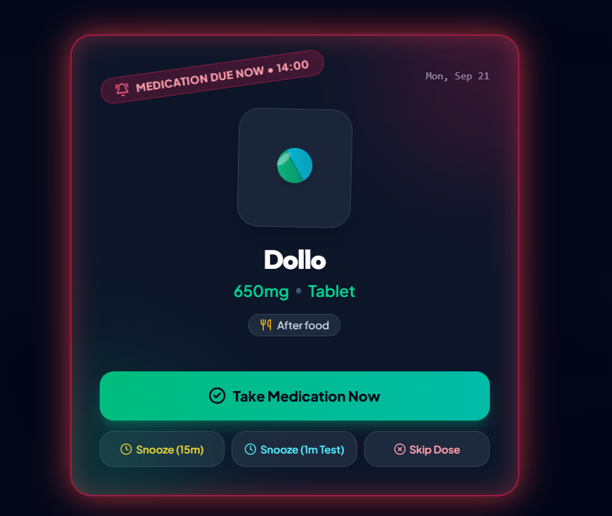
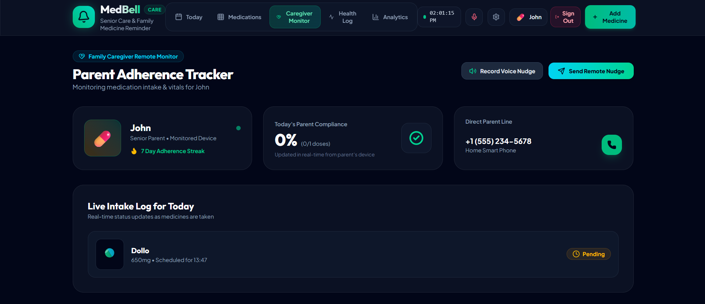
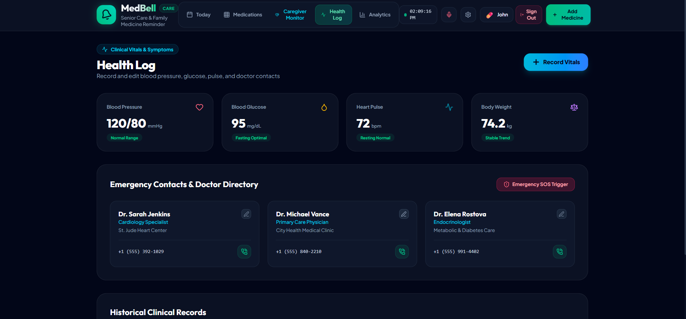
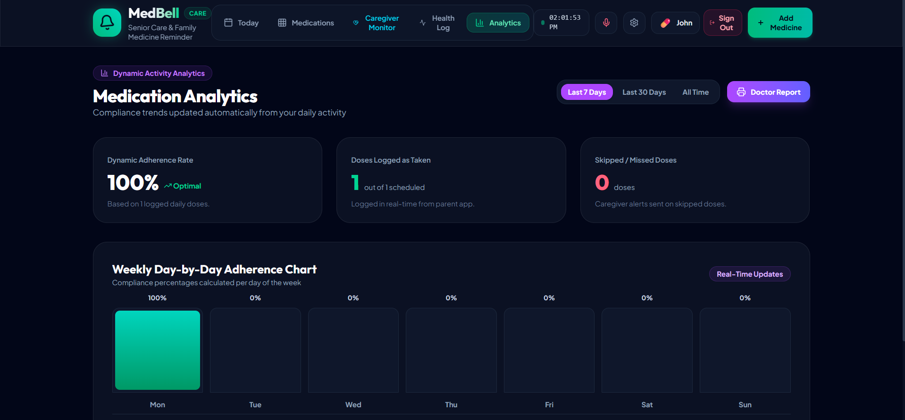

# MedBellCare — Senior Care & Family Medicine Reminder App


MedBellCare is a comprehensive, senior-accessible medication reminder and family caregiver remote monitoring web and mobile platform. Designed specifically to bridge the gap between elderly patients and their loved ones, MedBellCare ensures timely pill adherence, personalized audio/voice alarms, live health vital tracking, and real-time remote caregiver supervision.

---

## Problem Statement

Medication non-adherence among senior citizens and patients with chronic illnesses is a major healthcare challenge globally:
- **Complex Schedules & Memory Fatigue**: Elderly individuals often manage multiple prescriptions with varying dosages, times, and meal instructions (before, after, or with food).
- **Pill Confusion**: Misidentifying pills of similar shapes and colors can lead to accidental double-dosing or missed critical doses.
- **Caregiver Anxiety & Lack of Visibility**: Family members caring for elderly parents remotely struggle to verify if their loved ones have taken their essential daily medications on time without making intrusive phone calls.
- **Health Decompensation**: Missed doses of critical medications (e.g., blood pressure, diabetes, cardiac, antibiotics) lead to preventable health complications and hospital re-admissions.

MedBellCare solves these challenges by combining visual pill recognition, a voice-assisted reminder engine, caregiver remote nudges, and clinical health vital logs into one intuitive, high-contrast, senior-friendly interface.

---

## Project Description

**MedBellCare** is designed from the ground up to empower senior citizens while keeping family caregivers in the loop.

### Key Features

1. **3D Visual Pill Customizer**:
   - Customize pill shapes (*Capsule, Tablet, Oval, Hexagon, Liquid, Injection, Drops, Inhaler, Patch*) with distinct primary and accent/stripe color combinations for instant visual identification.

2. **Smart Audio & Voice Reminder Engine**:
   - Synthesized voice announcements powered by Google SpeechSynthesis reading medication names, doses, and meal instructions aloud.
   - Support for custom voice message recording (e.g., a child recording a personalized alarm tone for their parent).
   - High-contrast full-screen Alarm Overlay with Snooze (*15m / 1m test*) and Take/Skip actions.

3. **Daily Adherence Dashboard**:
   - Timed dose timeline categorized into Morning, Afternoon, Evening, and Night slots.
   - Interactive daily progress ring showing real-time adherence percentages and 7-day streaks.
   - Treatment period tracking with Start Date, End Date, and duration presets (*7, 14, 30 days, or Ongoing*).
   - Automatic low-stock refill alerts when medication inventory falls below custom thresholds.

4. **Family Caregiver Remote Monitor**:
   - Real-time parent compliance tracking dashboard for family members.
   - Remote "Nudge Ring" trigger to send audio alerts to the parent's device when a dose is pending or missed.
   - Missed dose alert banners and direct emergency calling button.

5. **Clinical Health Vitals & Doctor Directory**:
   - Record and adjust Blood Pressure (*Systolic/Diastolic*), Blood Glucose, Heart Pulse, and Body Weight.
   - Store prescribing doctor contacts with one-tap calling and Emergency SOS trigger.

6. **Dynamic Analytics & Doctor PDF Report Generator**:
   - Visual day-by-day weekly compliance charts (*Mon–Sun*) with dynamic 7-day, 30-day, and all-time filtering.
   - One-click printable clinical summary report formatted for physician consultations.

7. **Multi-Account Profile Isolation & Mobile Platform**:
   - Multi-user authentication (*Senior Parent, Family Caregiver*) with per-user data isolation in LocalStorage and JSON Backup Import/Export.
   - Built with Capacitor for seamless cross-platform deployment to Android devices.

---

## Google AI Usage

### Tools / Models Used

- **Google Gemini (2.5 Pro / Flash) & Antigravity AI**: Used for intelligent app architecture design, voice/speech prompt workflow modeling, senior accessibility UI optimization, and code structuring.
- **Web Speech API / Google Chrome Voice Synthesis**: Integrated into the speech service to synthesize natural vocal medicine reminders (*reading medicine names, dosages, and notes*).
- **Google Fonts (Outfit & Inter)**: Used for typography hierarchy to maximize legibility for elderly users.

---

## Tech Stack used

- **Frontend Core**: React 19, Vite 8, JavaScript (ES Modules)
- **Styling & Aesthetics**: Tailwind CSS v4, Vanilla CSS design tokens (*Glassmorphism, Neon glow effects, dark mode slate palette*), Lucide React Icons
- **State Management & Persistence**: React Context API (`MedicationProvider`), LocalStorage per-user data isolation
- **Audio & Speech Engine**: Web Audio API (*procedural chime alarm synth loop, WebM voice recording with MediaRecorder*), Web Speech API (`SpeechSynthesis`)
- **Native Mobile Bridge**: Capacitor 8 (*configured for Android app target*)
- **Tooling & Build**: Vite, Oxlint

---

### How Google AI Was Used

1. **Architectural & Senior Accessibility Guidance**:
   - AI models assisted in designing a high-contrast dark mode glassmorphism UI tailored for elderly eyes, featuring oversized touch targets, distinct color coding, and minimal cognitive friction.
2. **Audio & Speech Workflow Integration**:
   - AI helped model the notification and speech engine to construct natural-language voice prompts from prescription data fields (*name, dosage, foodTiming, notes*).
3. **Caregiver Sync & Clinical Reporting**:
   - AI guided the design of real-time adherence calculation algorithms and the clinical doctor PDF report layout for medical visits.

---

### GitHub repo link of the project

[MedBellCare GitHub Repository](https://github.com/mskarthik260308-art/MedBellCare)

---

## Proof of Google AI Usage

Proof of Google AI usage, prompts, and architectural logs are included in the [/proofs](./proofs) folder.
- `/proofs/ai_interaction_logs.md`: Overview of AI prompt modeling and architecture generation.
- `/proofs/google_ai_usage_summary.png`: Screenshot proof of Google AI interaction.

---

## Screenshots

Project screenshots illustrating key user flows:

### 1. Daily Adherence Dashboard


### 2. Full Medication Dashboard & Prescription Manager


### 3. Alarm Overlay & Voice Reminder Engine


### 4. Family Caregiver Remote Monitor


### 5. Clinical Health Vitals Log & Doctor Directory


### 6. Dynamic Medication Analytics & Doctor Report Generator


---

## Demo Video

[Watch MedBellCare Demo Video](https://drive.google.com/file/d/17WR0I6xKHMgDj-oiwOgbvE48GoDMseCe/view?usp=sharing)

---

## Installation Steps

Follow these steps to run MedBellCare locally on your machine:

### Prerequisites
- Node.js (v18+ recommended)
- npm or yarn

### 1. Clone the Repository
```bash
git clone https://github.com/mskarthik260308-art/MedBellCare.git
cd MedBellCare
```

### 2. Install Dependencies
```bash
npm install
```

### 3. Start the Development Server
```bash
npm run dev
```
Open your browser and navigate to `http://localhost:5173`.

### 4. Build for Production
```bash
npm run build
```
The optimized production bundle will be generated in the `dist` directory.

### 5. Preview Production Build
```bash
npm run preview
```

### 6. Build / Run on Mobile (Android via Capacitor)
```bash
# Sync web dist build to Android project
npx cap sync android

# Open project in Android Studio
npx cap open android
```
